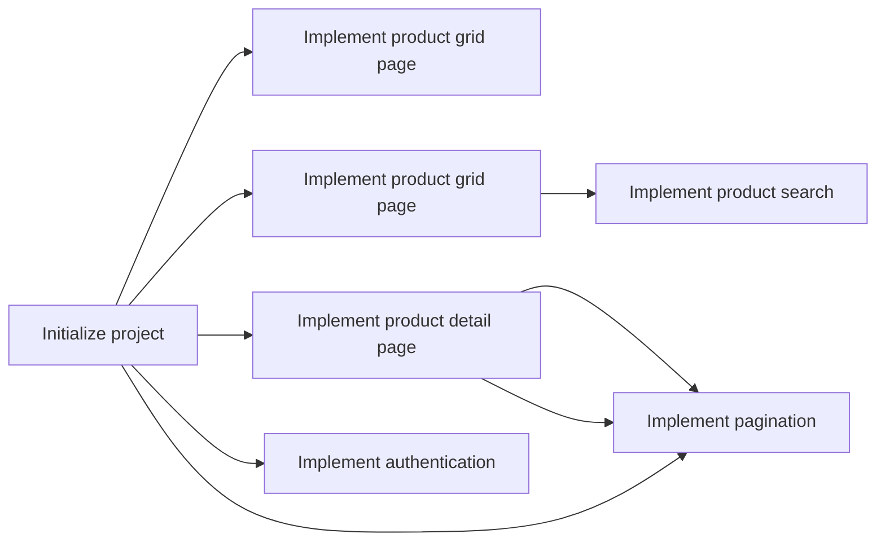

# Leadership and Workflow Management

## Architecture

To be defined.

## Task Allocation

| Task                                     | required experience | Developer strengths |
| ---------------------------------------- | ------------------- | ------------------- |
| Initialize project (scaffolding)         | Mid-level           | NextJS, GraphQL     |
| Implement product grid page              | Junior level        | CSS                 |
| Implement product search                 | Mid-level           | GraphQL             |
| Implement product detail page            | Junior level        | CSS                 |
| Implement "add review" feature           | Mid-level           | GraphQL             |
| Implement pagination (product + reviews) | Mid-level           | GraphQL             |
| Implement authentication                 | Senior-level        | Authentication      |

## Development workflow

1. **Refinement**. The requirement is presented to the developers (including designs). The developers are asking questions and are challenging the requirement based on complexity, usability, maintainability, dependencies and edge cases.
1. **Planning**. The requirement is planned for the next Sprint. The team decides together with the Product Owner, if the scope of the Sprint is achievable.
1. **Implementation**. The requirement is implemented.
1. **Code Review**. The code is reviewed by another developer in the team.
1. **QA**. The running application is tested end-to-end by a QA engineer OR other developer.
1. **Deployment**. The change is deployed to production.
1. **Monitoring**. The health of the system is monitored on production. Alerts are set up to identify suspicious errors automatically.

The team is following Scrum with the usual ceremonies (Planning, Refinement, Dailies, Sprint Review, Retrospective).
The team is using a ticket management tool like Jira with a Sprint board showing the status of all tickets within the Sprint.

## Communication

The team should share the current status of their tasks in a daily standup. Also, questions and concerns can be raised in a messenger channel (like Slack or MS teams). More detailed topics should be clarified in a direct phone call.
More delicate topics can be raised in a bi-weekly 1:1 with the team lead.
The achievements of the last sprint are communicated in the Sprint Review to stakeholders outside of the team.
Suggestions for improvements can be made in a Retrospective.

Blockers should be identified as early as possible (e.g. in the refinement of the ticket). The root cause of the blocker must be identified. A blocker owner must be identified who is responsible for the elimination of the blocker.
If a blocker is identified during the implementation of the ticket, the ticket should be set "on hold" until the blocker is resolved. Also, the ticket should be flagged as "impediment".

## Quality

High quality will be ensured by following the development workflow mentioned above.
Since this process is ticket-driven, there must not be a code change without a ticket.

### Code Reviews

Each code change is reviewed by another developer.

The following check list can be used:

- Can I understand the purpose of the code easily?
- Does the code fulfill the requirement completely?
- Are edge cases handled correctly?
- Could the change introduce regression? (e.g. by changing shared functionality)?
- Is the applied coding standard compliant to the rest of the code? (e.g. naming conventions)
- Does the pull request contain test automation?
- Is documentation provided?

A pull request can only be merged, if the reviewer approved the change.

### QA

During the QA step, the change is tested on different browsers (Safari, Firefox, Chrome, Edge) and multiple screen sizes (phone, tablet, desktop, large desktop) according to the acceptance criteria.

The following criteria are applied during the test:

- functionality
- performance (e.g. Web Vitals)
- security
- accessibility
- usability

It is expected that the developer who implemented the change did a self-review of his solution. The QA step is just an additional safety net performed by another engineer.

### Test automation

Test automation is going to be used to ensure the functional quality of the application. The automation needs to be delivered in the same ticket as the actual implementation.

The following test types are used:

- Unit tests (e.g. on UI component level); Jest + React Testing Library can be used
- Integration tests (e.g. on screen level); backend is mocked; Jest + React Testing Library can be used
- End to end tests (on application level); real backend is used; Cypress can be used

A visual testing tool like Percy can help to avoid visual regression.
An accessibility test tool like Axe can help to identify accessibility gaps automatically.

The test automation must be executed in the CI/CD pipeline. If the tests are failing, the change cannot be merged.

### Linting & formatting

A set of linting rules (e.g. ESLint + Airbnb config) ca be used to keep the code quality up.
A formatting tool (e.g. Prettier) ensures the maintainability / readability of the code.

### Tech Debt

Technical debt is inevitable. The team should work 20 % of the Sprint on technical maintenance. This includes:

- Code refactoring
- Increasing test coverage
- Update dependency versions
- a.s.o.

## Project Management

### Estimates

The estimations of each tasks contain the effort to implement, review, test and deploy the changes.

| Task                                     | estimate (in person days) |
| ---------------------------------------- | ------------------------- |
| Initialize project (scaffolding)         | 3                         |
| Implement product grid page              | 3                         |
| Implement product search                 | 3                         |
| Implement product detail page            | 4                         |
| Implement "add review" feature           | 2                         |
| Implement pagination (product + reviews) | 4                         |
| Implement authentication                 | 3                         |

### Tasks dependencies

